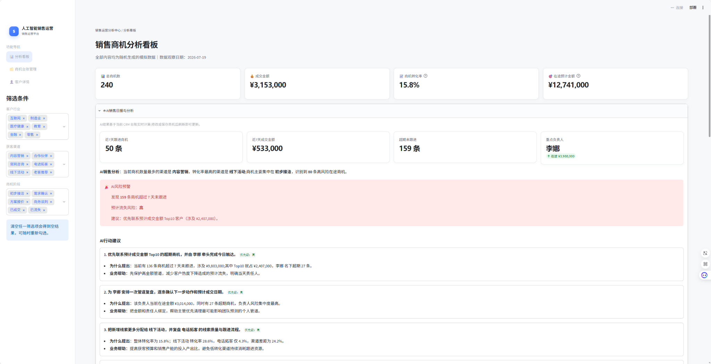
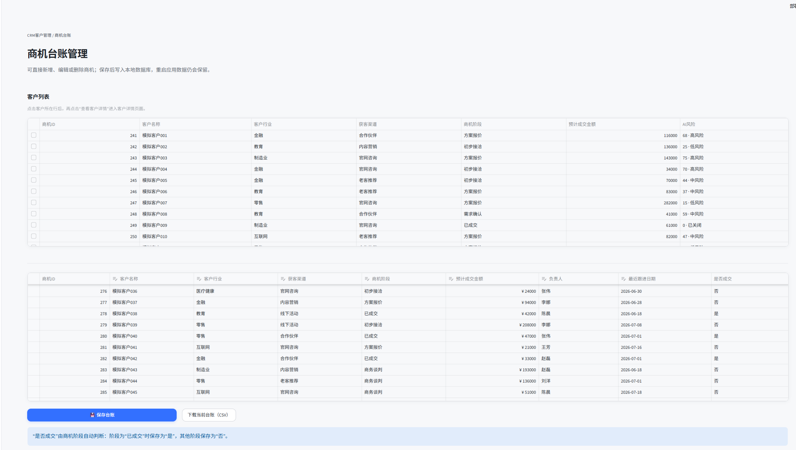
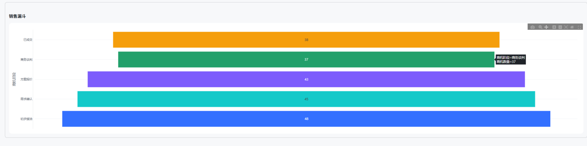
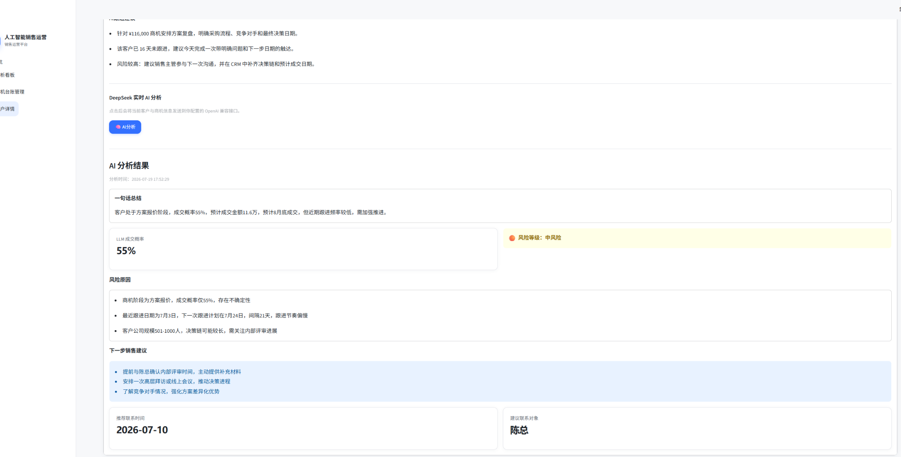

# 🚀 AI销售运营平台（AI Sales Operations Platform）

面向企业销售团队的本地化 AI 销售运营平台演示项目。项目以真实企业的销售运营工作流为参考，围绕商机、客户、销售漏斗、跟进节奏和管理决策构建，而不只是展示静态图表。

> 当前版本使用模拟销售数据，所有联系人、电话和邮箱均为脱敏演示值，不对应任何真实个人或企业。

<p align="center">
  
</p>

<p align="center">
  面向 ToB 销售团队的 AI 销售运营平台原型，连接 CRM、销售漏斗与可执行的 AI 决策建议。
</p>


## 📑 目录

- [🎯 项目背景](#项目背景)
- [🧭 产品定位](#产品定位)
- [🧩 功能模块](#功能模块)
- [🛠️ 技术栈](#技术栈)
- [🤖 数据与 AI 说明](#数据与-ai-说明)
- [✨ 项目亮点（Features）](#项目亮点features)
- [🖼️ 项目预览](#项目预览)
- [🗂️ 项目结构](#项目结构)
- [⚡ 快速开始](#快速开始)
- [✅ 测试与质量检查](#测试与质量检查)
- [💼 项目价值](#项目价值)
- [🗺️ 后续规划](#后续规划)
- [🔐 安全与隐私](#安全与隐私)
- [📄 许可证](#许可证)

## 🎯 项目背景

企业销售团队每天需要持续管理客户、商机、负责人、销售阶段、预计金额和跟进活动。销售经理不仅要知道“当前有多少商机”，还需要回答：

- 哪些渠道带来的客户质量更高？
- 哪些商机正在停滞或可能流失？
- 未来一段时间的销售管道是否足够支撑目标？
- 哪位负责人需要支持，下一步应该优先做什么？

传统销售看板通常只能展示 KPI、金额和图表，缺少从数据到行动的分析闭环。本项目在销售运营分析和 CRM 客户管理的基础上，增加 AI 销售分析、风险预警和行动建议，探索 AI 如何帮助销售经理提升管道管理效率、降低商机流失风险并改善业务决策质量。

## 🧭 产品定位

本项目定位为一个面向企业 ToB 销售场景的 AI 销售运营平台原型，重点模拟以下工作链路：

```text
商机录入 → 客户与商机维护 → 销售跟进 → 漏斗分析 → AI风险识别 → 行动建议 → 管道决策
```

它适合作为销售运营产品原型、CRM 能力验证项目、AI+销售场景研究项目和企业软件解决方案演示基础。

## 🧩 功能模块

### 1. 📊 销售运营分析中心

帮助销售经理快速掌握团队整体管道情况：

- **KPI 指标**：总商机数、成交金额、商机转化率、在途预计金额。
- **渠道分析**：各获客渠道的商机数量、成交数量和转化率。
- **转化率分析**：支持在筛选范围内观察整体及渠道转化表现。
- **销售漏斗**：展示从初步接洽、需求确认、方案报价、商务谈判到成交的阶段分布。
- **行业分析与筛选**：按客户行业查看和筛选销售管道。
- **多维筛选**：支持按客户行业、获客渠道和商机阶段组合分析。
- **超期跟进提醒**：识别超过 7 天未跟进且尚未成交的商机。

### 2. 🧩 CRM 客户管理

围绕商机台账模拟企业 CRM 的日常维护流程：

- **商机管理**：查看、新增、编辑和删除商机记录。
- **客户详情**：查看客户基本信息、公司规模、地区、所属行业和获客渠道。
- **联系人**：展示脱敏的联系人姓名、职位、电话和演示邮箱。
- **商机信息**：查看商机阶段、成交概率、预计成交金额和预计成交日期。
- **跟进记录**：以时间轴形式查看销售跟进记录、最近跟进时间和下一次跟进时间。
- **本地持久化**：商机台账保存到项目目录中的 SQLite 数据库，应用重启后数据仍然保留。

### 3. 🤖 AI 销售分析

AI 能力嵌入现有分析看板和客户详情，不新增独立 AI 系统：

- **AI 销售日报**：根据近 7 天跟进、成交金额、超期商机和负责人管道生成动态摘要。
- **AI 销售分析**：识别商机最多的渠道、转化率最高的渠道、阶段集中度和高风险商机数量。
- **AI 客户画像**：结合客户行业、获客渠道、同业商机数量、来源转化率和负责人管道生成画像。
- **AI 风险预警**：综合跟进间隔、商机阶段和金额等信号，对商机进行可解释的风险评分。
- **AI 跟进建议**：根据当前阶段、金额、负责人和超期状态生成下一步销售动作建议。
- **AI 行动建议**：至少生成 5 条包含“建议、提出原因、业务帮助、优先级”的动态建议，覆盖商机数量、转化率、在途金额、超期未跟进和负责人等指标。
- **DeepSeek 实时分析（可选）**：配置 API Key 后，可在客户详情页主动发起 LLM 分析，获得成交概率、风险原因和下一步建议。

### 4. 💾 数据管理

- **数据维护**：通过 CRM 台账直接新增、修改和删除商机。
- **CSV 导出**：下载当前台账为 UTF-8 编码 CSV 文件，便于 Excel 查看或外部分析。
- **CSV 导入**：当前版本尚未开放批量导入界面，已列入后续规划；现阶段可通过台账编辑器维护数据。
- **数据校验**：保存时校验必填字段、金额格式、金额范围和商机阶段，避免无效数据进入分析结果。

## 🛠️ 技术栈

| 技术 | 用途 |
| --- | --- |
| Python | 应用逻辑、数据处理和本地服务运行时 |
| Streamlit | 数据应用界面和交互式 CRM 页面 |
| Pandas | 数据清洗、聚合、指标计算和分析 |
| Plotly | 渠道图表和销售漏斗可视化 |
| SQLite | 本地商机台账持久化 |
| Pytest | 自动化测试 |
| Codex | 辅助产品设计、代码开发和测试迭代 |
| OpenAI Python SDK | 调用 DeepSeek 的 OpenAI 兼容 Chat Completions 接口 |

## 🤖 数据与 AI 说明

### 📦 数据来源

首次启动时，系统使用固定随机种子生成结构稳定的模拟销售数据。之后应用读取项目目录下的 `sales_opportunities.db`，台账保存后的数据会成为后续分析和 AI 计算的数据来源。

### 🧮 本地规则分析（默认能力）

销售日报、客户画像、风险评分、跟进建议和行动建议由本地统计与规则逻辑动态计算。这部分能力不会调用外部大模型 API，也不需要配置 API Key：

- 风险评分使用跟进天数、阶段、金额分位和成交状态等特征。
- 客户画像使用当前客户与全量台账的行业、渠道、负责人聚合结果。
- 行动建议使用当前数据实时计算，建议内容、涉及金额、负责人和优先级会随数据变化。

因此，即使没有配置 DeepSeek，KPI、CRM、销售漏斗和全部本地规则分析仍可正常使用。相关结果适合作为 AI 销售运营逻辑验证和产品原型，不应直接替代企业正式的销售预测、信用判断或经营决策系统。

### 🔌 DeepSeek 实时 AI 分析

DeepSeek 是独立于本地规则分析的可选能力。只有在已配置 API Key 且用户在客户详情页主动点击“🧠 AI分析”时，系统才会将当前客户、商机和模拟详情信息发送到配置的 DeepSeek OpenAI 兼容接口，并在页面展示：

- 风险分析及判断依据；
- LLM 返回的成交概率；
- 包含对象、动作和时间的下一步销售建议。

配置方式（PowerShell）：

```powershell
$env:DEEPSEEK_API_KEY = "你的 DeepSeek API Key"
$env:DEEPSEEK_BASE_URL = "https://api.deepseek.com"
$env:DEEPSEEK_MODEL = "deepseek-chat"
```

也可以使用其他 OpenAI 兼容服务，只需替换 `DEEPSEEK_BASE_URL` 和 `DEEPSEEK_MODEL`。API Key 只从环境变量读取，不要写入 `app.py`、README 或提交到 Git 仓库。未配置 Key 时，DeepSeek 请求不会发出，页面会给出配置提示，原有本地规则分析不受影响。

## ✨ 项目亮点（Features）

| 能力 | 说明 |
| --- | --- |
| 🤖 AI 销售分析 | 从“看数据”延伸到解释数据、识别问题和辅助决策。 |
| 🎯 AI 行动建议 | 结合商机数量、转化率、在途金额和负责人生成可执行动作。 |
| ⚠️ AI 风险预警 | 关注超期未跟进和阶段停滞，帮助团队优先处理高风险商机。 |
| 🧩 CRM 客户管理 | 覆盖商机台账、客户详情、联系人和跟进记录。 |
| 🔻 销售漏斗分析 | 直观呈现各阶段商机分布，辅助判断管道健康度。 |
| 📈 数据可视化 | 通过 KPI、渠道分析和 Plotly 图表快速理解业务表现。 |
| 💻 本地可运行 | 不配置外部服务也可使用核心功能，适合演示、学习和校招项目展示。 |
| 🔄 增量式设计 | AI 能力嵌入现有页面，保留原有 CRM 与分析工作流。 |

1. **AI 销售分析**：从“看数据”延伸到“解释数据和识别问题”。
2. **AI 行动建议**：围绕真实销售指标给出可执行的下一步动作和优先级。
3. **AI 风险预警**：根据跟进节奏、阶段和金额识别潜在流失商机。
4. **CRM 流程模拟**：覆盖商机台账、客户详情、联系人和跟进记录等日常流程。
5. **企业销售运营场景**：以销售经理的管道管理、资源分配和预测决策为核心。
6. **数据可视化**：通过 KPI、渠道分析和销售漏斗呈现关键经营信息。
7. **本地可运行与可复现**：无需外部服务即可运行核心功能，适合产品演示和能力验证。
8. **增量式设计**：AI 能力嵌入现有页面，不破坏原有 CRM 和分析工作流。

## 🖼️ 项目预览

以下截图展示平台的主要使用场景，顺序为 Dashboard、CRM、Sales Funnel、AI Analysis。

### 📊 Dashboard

<p align="center">
  
</p>

### 🧩 CRM



### 🔻 Sales Funnel



### 🤖 AI Analysis



## 🗂️ 项目结构

```text
.
├── .github/
│   └── workflows/
│       └── tests.yml             # GitHub Actions 自动测试
├── .streamlit/
│   └── config.toml               # Streamlit 主题配置
├── screenshots/                  # 项目预览截图
│   ├── dashboard.png
│   ├── crm.png
│   ├── sales-funnel.png
│   └── ai-analysis.png
├── styles/
│   ├── style.css                 # 全站统一样式
│   └── theme.py                  # 主题组件与 Plotly 配置
├── app.py                        # Streamlit 应用、分析逻辑和 CRM 页面
├── test_app.py                   # 自动化测试
├── requirements.txt              # Python 依赖
├── sales_opportunities.db        # 运行后生成的本地 SQLite 台账（不纳入版本管理）
└── README.md                     # 项目说明
```

## ⚡ 快速开始

### 🧰 环境要求

- Python 3.10 或更高版本
- Windows、macOS 或 Linux
- 建议使用虚拟环境隔离项目依赖

### 📦 安装依赖

在项目目录中执行：

```powershell
python -m venv .venv
.\.venv\Scripts\python.exe -m pip install -r requirements.txt pytest
```

如果使用 macOS 或 Linux：

```bash
python3 -m venv .venv
.venv/bin/python -m pip install -r requirements.txt pytest
```

### ▶️ 启动应用

Windows：

```powershell
.\.venv\Scripts\python.exe -m streamlit run app.py
```

macOS 或 Linux：

```bash
.venv/bin/python -m streamlit run app.py
```

启动后访问：<http://localhost:8501>

### 🧭 基本使用流程

1. 在“分析看板”查看 KPI、渠道分析、漏斗和 AI 销售分析。
2. 在左侧切换到“商机台账管理”。
3. 点击客户行查看客户详情、AI 客户画像和跟进建议。
4. 修改或新增商机后点击“保存台账”。
5. 返回分析看板，查看最新数据驱动的指标和 AI 建议。

## ✅ 测试与质量检查

运行全部自动化测试：

```powershell
.\.venv\Scripts\python.exe -m pytest -q
```

进行 Python 语法检查：

```powershell
.\.venv\Scripts\python.exe -m compileall -q app.py test_app.py
```

测试覆盖数据生成、指标计算、筛选、数据库持久化、数据校验、客户详情、AI 风险评分和 AI 行动建议。

仓库同时配置 GitHub Actions，在推送代码或创建 Pull Request 时自动执行 pytest 和 Python 语法编译检查。自动测试不需要配置 DeepSeek API Key，也不会向外部 AI 服务发起请求。

## 💼 项目价值

这个项目不是简单的数据可视化，而是对企业销售运营工作流程的模拟：销售人员维护客户和商机，销售经理观察管道与漏斗，系统识别超期和风险，并将数据转化为下一步行动建议。

项目适用于：

- 飞书商业化团队和 Go To Market 场景
- 企业软件和 SaaS 销售管理
- CRM 产品能力验证
- ToB 销售运营和销售管理培训
- AI + 销售运营产品原型设计

## 🗺️ 后续规划

后续可按企业级产品化优先级逐步演进：

- 扩展可配置 LLM 支持，并增加可控的企业知识库检索
- 将 SQLite 升级为 PostgreSQL 等生产级数据库
- 完成 CSV 批量导入、字段映射和导入错误报告
- 增加用户权限、角色和数据范围控制
- 增加登录系统、组织架构和多租户隔离
- 扩展 AI 客户画像和客户生命周期分析
- 接入 AI 会议纪要、通话总结和自动生成跟进记录
- 对接飞书、Salesforce、销售易等外部 CRM 或协作系统
- 增加审计日志、数据质量监控和模型结果反馈闭环
- 增加销售目标、预测版本和团队经营复盘能力

## 🔐 安全与隐私

- 当前项目只使用模拟销售数据。
- 联系人电话采用脱敏格式，邮箱使用 `example.demo` 演示域名。
- 本地规则分析不会向外部 AI 服务发送数据。
- 只有在用户配置 API Key 并主动点击“AI分析”时，当前客户、商机和模拟详情信息才会发送到配置的 OpenAI 兼容服务。
- 生产环境使用前，应补充身份认证、权限控制、加密存储、审计日志、备份恢复和敏感数据治理。

## 📄 许可证

当前仓库未指定开源许可证。如需公开发布或被其他团队复用，请根据组织要求补充 LICENSE 文件并明确第三方依赖的许可边界。
